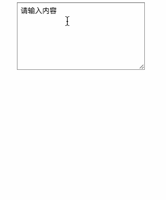

# auto-height-textarea

实现 textarea 高度根据内容自适应.



## 引入

```
<script src="./dist/auto-height-textarea.js"></script>
```

## 使用

```
var textarea = document.getElementById("textarea");
    autoTextArea(textarea);
```

`autoTextArea`: 参数为需要格式化的 textarea, 高度使用 `min-height` 指定